% Final report - first draft

# Abstract

# Introduction

Due to temperature and salinity differences density driven currents can occur. Because important water systems such as the drinking water supply and large coastal water systems in the Netherlands are strongly influenced by these currents it is important to understand these phenomena. With the use of D-Flow FM, a software package by Deltares, the mixture of salt- and fresh water can be numerically approximated. However, a side effect of these numerical flow models is the occurrence of numerical diffusion and dispersion caused by characteristics of the numerical discretization scheme that is used and the type of flow that is modelled.

Numerical diffusion is sometimes referred to as "numerical viscosity" since the associated approximation errors mimic the effect of an increase in viscosity, i.e. the solution is overdamped. Besides, numerical dispersion is related to unrealistic oscillations in an approximation of an advection-diffusion problem that may occur if stability of the solution is not ensured or if the observed phenomena are not smooth enough for the discretized solutions of the problem posed. Because avoiding such errors requires contrasting measures within the numerical model a quantification of their responses to certain modelling parameters is desirable. [@zijlema_computational_2015; @obrien_study_1950]

To be able to refer the sensitivity of numerical errors produced by D-Flow FM to specific settings and parameters of the model a lock-exchange experiment is set up. In a lock-exhange the initial situation consists of a rectangular tank with a free water equally leveled surface, for one half containing a fluid with a higher density than on the other half of the fluid tank, split vertically. In this research the density difference is caused by a salinity difference. At the start of the experiment (t=0) these fluids set in motion and from two wavefronts, a negative and a positive as a result of the gravitiational and buoyant forces. The numerical errors produced during such an experiment have often been investigated and this research aims to use the results obtained from this experiment as a measure for the order of accuracy of the D-Flow FM numerical flow model. 

Firstly, in modelling flow and transport phenomena, and numerical modelling in general, two variables have a major effect on the stability and accuracy of the solution; the spatial resolution and time step size. Additionally there are many different other numerical and flow related parameters in D-Flow FM that can be set and might have influence on the numerical errors produced. These will all be varied within relevant ranges during four stages of the simulation phase of this research; temporal variations, variations in spatial resolution, variations in the initial salinity difference and variations of other numerical parameters. Secondly, with respect to the lock-exchange experiment three characteristic variables are distinguished; the frontal wavespeed, the thickness of the mixing layer and the waterlevel. The goal of this research is thus to relate the numerical dispersion and -diffusion observed in the output of these characteristic lock-exchange variables to the change of the temporal and spatial resolution, the forcing and other numerical parameters of D-Flow FM. 

To this end a sensitivity analysis per parameter is performed, where the sensitivity S of a parameter P is defined as the relative change of a state variable per change of this parameter: S = (δx/x)/(δP/P). State variables are defined as the numerical dispersion and -diffusion observed in the output of the characteristic variables of the lock-exchange experiment. To quantify the errors of interest first the observed results will be normalized to the varying parameter and plotted against the observed errors. For example to quantify the errors observed while varying the resolution in x-, y- and z-direction the ratio of the cell-lenght, -width and -height will be considered to enable computation times to stay relatively similar. Hereafter they may be related to certain indicator parameters such as the Froude and Reynolds numbers at characteristic locations of the lock-exchange experiment. Finally, available and possibly relevant indicator parameters are the amount of times a cell was Courant limiting, the computed Richardson numbers and other numerical conditions. Depending on the parameters' relevance to each they are proposed to serve as an explanation for the observed errors. Subsequently the observed data is analyzed and compared to results found in different in order to verify and explain the computed results. 

This document describes the research questions and hypotheses in the second chapter, subsequently it will provide some background information related to the lock-exchange, to modelling of flow and transport in general and to D-Flow Flexible Mesh in chapter three. Then, in chapter four the method used to test the hypotheses is presented. The model used as a constant basis throughout the parameter variations is discussed in chapter 5. Finally the results are presented in chapter six and further discussed in chapter 7.

# Research Question & Hypothesis
## Research questions

1. How much numerical diffusion and or dispersion does the D-Flow FM model produce when simulating a 3D lock-exchange experiment?

    1. What is the order of errors produced by D-Flow FM as a result of numerical diffusion and/or dispersion?

    2. How sensitive is the accuracy of the D-Flow FM model to time, space and numerically related parameters?

    3. What sort of errors are produced given different parameters?

    4. What parameters in the D-Flow FM model have the largest influence on errors related to numerical diffusion and dispersion?

    5. Are there indicators that predict the occurrence of numerical diffusion and dispersion in D-Flow FM?
    
    6. How do the fysics around the mixing layer develop and what influence does this have on the accuracy numerical approximation in terms of numerical diffusion and -dispersion?

    7. How does the frontal wave speed develop compared to solutions that might be expected from the characteristic equations?

    8. How do internal waves develop at different model parameters and settings?

    9. What effect do internal waves have on the produced numerical errors?

    10. What can be done to avoid such errors?

## Hypotheses
#1. There is significant numerical diffusion and negligible numerical dispersion in the D-Flow FM model when performing a lock-exchange experiment because the hydrostatic assumptions of the shallow water equations, and thus the numerical scheme within D-Flow, can not deal with the initial vertical pressure gradient but accounts sufficiently for the posed boundary conditions. 

    #2. It is very sensitive to time and space related parameters and can be slightly improved by flow model parameters. This is mostly the case with finite difference methods, however it may be improved by certain parameters that make the model more implicit.

    #3. Mostly numerical diffusion errors are produced except when more elaborate advection schemes are applied. 

    #4. The time step size, grid resolution and viscosity have the larges influence leverage on the accuracy of the model.

    #5. Examples of such indicators are the dimensionless Reynolds and Froude numbers or the ratio between the net diffusivity coefficient in the model and the eddy viscosity terms imposed by D-Flow FM. 

    #6. The physical process is naturally damped by viscosity thus at some point the higher-order terms that are included in the truncation error of the numerical scheme will become of lesser influence, therefore numerical diffusion and dispersion will reduce over time. I.e. the shallow water equations will fit the flow better if it is more smooth. 

    #7. Riemann invariants may be formed for the flow front if the velocity variations far away from the front are negligible and thus the frontal wave speed may be considered to constant along a characteristic. 

    #8. When viscosity plays a more important role internal wave can be expected to be greater. This is at high density differences and at high flow velocities. 

    #9. The numerical diffusion is increased a lot by the occurence of a lot of internal waves because the approximation is limited in it's vertical velocity gradient by the hydrostatic assumption. 

# Background

To be able to refer the sensitivity of numerical errors produced by D-Flow FM to specific settings and parameters of the model a lock-exchange experiment is set up. In a lock-exhange the initial situation consists of a rectangular tank with a horizontal free water surface, for one half containing a fluid with a higher density than on the other half of the fluid tank, split vertically. In this research the density difference is caused by an initial salinity difference. At the start of the experiment (t=0) these fluids set in motion and from two wavefronts, a low- and high density front as a result of the gravitiational and buoyant forces. The numerical errors produced during such an experiment have often been investigated and this research aims to use the results obtained from this experiment as a measure for the order of accuracy of the D-Flow FM numerical flow model and a guide to avoid such errors in subsequent modelling.

Because D-Flow FM implements many complex details of a numerical scheme only a few important aspects are shortly described here. For further elaboration the reader is referred to Appendix B - D-Flow Flexible Mesh or [@DFlowTechMan]. D-Flow FM implements the shallow water equations that have as basic assumptions that the vertical velocity is small compared to horizontal scale, the vertical pressure is nearly hydrostatic and wave induced accelerations in the vertical cause negligible effect on the pressure distribution compared to the wave induced height difference. Further the shallow water equations have as property that the water density is directly proportional to bed- and wind friction terms. D-Flow FM uses an finite differences method with an upwind scheme (implicit) to solve the governing equations. Most importantly D-Flow is capable of implementing many sorts of meshgrid types, including triangles, quids, pentagons and hexagons in a curvilinear grid. 

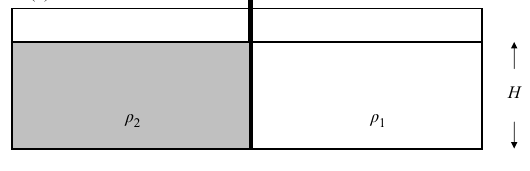

In general finite differences based methods used to approximate convection-diffusion problems using the shallow water equations, the hydrostatic assumption causes errors related to vertical accelerations that can not be accounted for (i.e. vertical velocity gradients). Because the continuity equation can only account for small variations in the vertical velocity gradient when larger accelerations occur numerical models show physically unrealistic phenomena such as spurious oscillations in salinity profiles and, in the case of the lock-exchange esperiment, smaller propagations speeds of the two density fronts than would be expected based on the energy balance [@Pietrzak1998]. This is also experimentally confirmed as presented in @Simpson1998. Thus depending on the order of velocity varations in the vertical, given a specific timestep size and spatial resolution, the hydrostatic assumption can cause larger or smaller numerical errors. In practice this means the modelled flow should be more or less laminar which allows the solution to be smoothly varying and the continuity equation can account for the vertical velocity variations. Taking this into account, during a lock exchange experiment the largest errors may be expected near the density fronts and near the interface between the two density driven currents, due to respectively steep salinity gradients causing large discontinuities and high shear stresses causing turbulence thus vertical velocity gradient (also known as the Benard-Von Karman instability [@Mathis1984]).

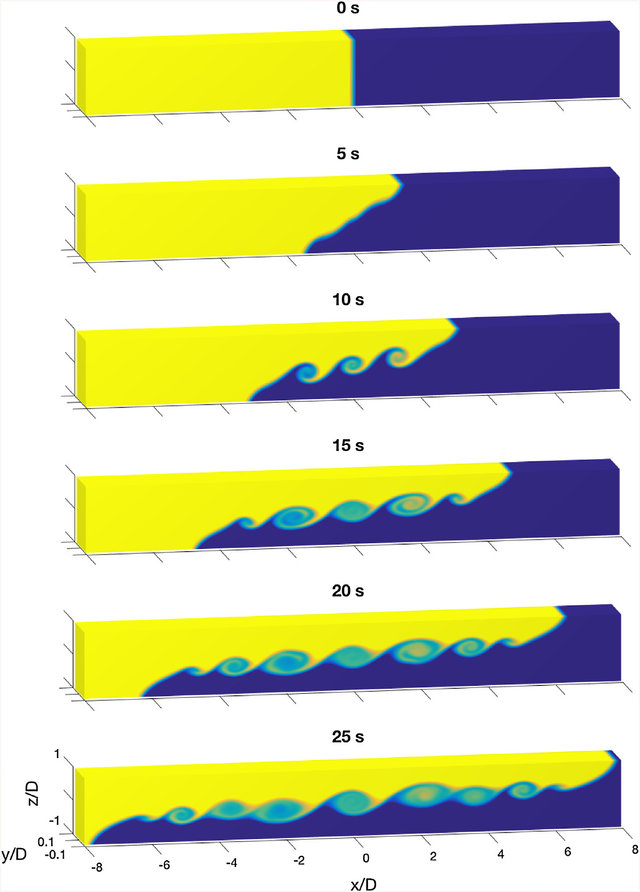

For most flows in a lock exchange, depending mostly on the Reynolds number [@Shin2004], resistance can be ignored. Also described in [@Battjes2017], when damping of wave amplitude is as little as possible the energy conserving assumption is most valid and uniform flow behind the wavefront can be assumed. By examening the flow based on the above assumptions, numerical errors may also be be recognized at times when the hydrostatic assumption is least valid. For example at t=0 because of the large initial disturbance, when a relatively large velocity gradient between the two sides of each front occurs, numerical dispersion could occur because the model struggles to account for these large gradients. Similarly at times when Benard-Von Karman instabilities are fully developed numerical diffusion may be significant, since the type of numerical models considered tend to flatten out these smaller-scale vertical velocity gradients. Lastly, if the frontal propagation speeds (the propagation velocity of the low- and high density front) does not comply with estimations as proposed by literature [@Pietrzak1998] it could be an indication of numerical diffusion.

**TODO: give formulae for shallow water equations, convection equation and numerical model**
**TODO: explain the courant number and other numerical conditions shortly**

# Method
To support answers to the research questions with data and reasonable arguments and thus finally obtain an indication and quantification of the numerical dispersion and -diffusion produced by D-Flow FM the following research method is presented.

The method is split in three phases: modelling, simulation, analysis, which respectively comprise the modelling and describing of the frame of reference, running simulations over a range of values per parameter and analyzing the results using a sensitiviy analysis and appropriate indicator parameters. Herafter the produced results can be discussed and possibly conclusions with respect to the to the research questions can be drawn.

## Reference model
During the modelling phase one determines a reference model through modelling large ranges of desirably constant parameters. Based on a qualitative analysis of these results the model settings and parameters that will remain constant throughout the further research are reasonably defined.

First the terms and settings found in the basic D-Flow FM model are explored. In this reference model the observed numerical dispersion and -diffusion should be of an acceptable range and more importantly subject to little change. In the initial reference model a basic setup of the boundary conditions, the width, lenght and depth of the model and timescale of the simulation are determined. This takes a few iterations and requires basic post processing of the results to asses the characteristic variables of the different simulations, in this case the temperature and number of layers in the vertical direction are considerd. Through the results presented in this report it becomes clear which settings give minimal numerical diffusion and dispersion.

In order to provide a solid basis for the sensitivity analysis the reference model has to be sufficiently robust to enable all parameters to be explored. Besides after every parameter variation constant value for this parameter should be logically determined. To ensure a working model first most default settings are used to set up the lock-exchange model. In this model the following parameters are thus defined; general settings such as working directory, model name etc. The basic geometry including lenght, width and depth. Basic physics such as water density, gravity acceleration etc. Boundary conditions being closed free-slip boundaries for either velocity or discharge. A computational grid with n- and m-number of cells in x- and y-direction respectively. And finally if desired location specific monitoring points with a higher frequency of output can be determined to reduce the memory load of the model. 

With respect to post-processing two parameters are evaluated; the width averaged waterlevel over time and the width averaged salinity over time. These state variables indicate numerical errors and enable classification of the observed error. For the salinity profiles points where they either have an extreme (physically unrealistic) value are highlighted and locations where characteristic values of the solution can be expected are inspected in more detail.

After reasonable accuracy and stability of the simulation is ensured the initial reference model is thus defined, although some final aspects of the model may be refined. Possibly more realistic physical properties, boundary conditions, a more relevant geometry or specifics of the flow model such as bed friction can be be set based on the qualitative analysis of the produced results. However, most of these are expected to be left at their default values and their are otherwise clearly substantiated with relevant arguments.

## Simulations
In order to generate the data required for the sensitivity analysis a number of simulations have to be performed. By varying the different parameters **the characteristic variables, defined as the frontal wavespeed, the thickness of the mixing layer and the waterlevel,** the associated numerical errors can be computed. Because this is done over a realistic and relevant range of values numerical diffusion and -dispersion errors produced by D-Flow FM can be quantified and accordingly conclusions based on flow related- and numerical indicators may be drawn.

### Interval analysis
To reasonably define the ranges for each parameter over which it will be varied an interval analysis is performed. This analysis will provide insight in what results come from different ranges of parameters and how applicable certain combinations of ranges are. Moreover it will provide insight in how many experiments have to be run and what values per parameter may be expected. **SOURCE AND FURTHER METHOD**

### Parameter variations
Based on variation in temperature and number of layers in the z-direction the model's response to some basic parameters is explored. Based upon these observations an initial reference model for the temporal variations is determined. For the parameter variations the sequential order matters as it is desirable to have a constant timestep for all variations and therefore to have investigated the effect of the Courant number in combination with D-Flow FM's automatic time step setting before setting this constant timestep. Lastly when the temporal and spatial variations are finalized a reference model can be set up for the variation of miscellaneous numerical parameters such as type of numerical scheme and limiter or entrainment and friction types.

After simulations with a varying Courant number, while using the automatic time step setting in D-Flow FM (see appendix \ref{appendix-dflow}), the first results are examined and compared to the reference model. Because the Courant number plays an important role in computational fluid dynamics it serves as an important measure in the subsequent variations. Herafter the timestep is set constant over the simulation and it's size is varied, which gives the variation of the time step size parameter. By the means of these results a constant time step size for the next parameter variations will be chosen. Herewith a constant reference model for the spatial variations is thus obtained. 

Next, naturally, the spatial resolution is varied and examined. Possibly because of the third order factor of space monitoring points may be desirable in order to maintain realistic computation times. These monitoring points have to be set up at logically sound locations within the reference model and will give a high resolution insight in the development of characteristic variables at specific locations over time.  Although the number of layers is prematurely examined in the reference model both Δx and Δz are varied. This is initially done for the default rectangular shaped meshgrid and later verified for different types of meshgrid, including triangles, quids, pentagons and hexagons. 

Finally other parameters such as the ones listed below can be varied and examined:

* Viscosity
* Bed friction
* Entrainment (mixing terms)
* Advection scheme
* Solver parameters 

For the experiments to be able to run the simulation procedure based on the reference model and the post-processing is automated as much as possible using Python. These scripts can be found in appendix \ref{appendix-python}. 

## Data analysis
The data analysis consists of a qualitative analysis of the results and accordingly a just quantification of the observed errors in order for the errors to be used in the sensitivity analysis. This is done, firstly, by plotting the Courant numbers at the low density front (LDF) and the high density front (HDF) versus the diffusion rates of these fronts, defined as the observed propagation speed of the front divided by the analytically defined propagation speed of the front [@Pietrzak1998]. Secondly, by looking at the salinity of a single cell over time at three different locations and at different depths, in order to observe the effect of both the fully developed fronts (travelling in opposite directions) and to get insight in what happens at the initial disturbance.

**During the qualitative analysis the results of all the post processing of the different performed experiments are analyzed and a relation between the sensitiviy of the observed numerical errors to the change in certain parameters are sought for, either physically or numerically. 

In order to correctly quantify the observed errors it will be determined what indicator parameters are of significance and what numerical conditions are applicable. Herafter a sensitivity analysis is performed, where the sensitivity of a parameter S(P) is defined as the relative change of a state variable per change of this parameter: S = (δx/x)/(δP/P). State variables are defined as the numerical dispersion and -diffusion observed in the output of the characteristic variables of the lock-exchange experiment. To quantify the errors of interest first the observed results are normalized to the varying parameter as prescribed by the conclusions of the qualitative analysis and similar methods used in literature [@Shin2004; @Adduce2012].**

# Results
## Modelling 
As a first exploration a few models were run with a single layer in the vertical direction. After some basic results were obtained the first results of experiments with 10 layers in the vertical direction were analyzed using Python based post-processing. Herafter consistently two output parameters averaged over the width were compared over time: the waterlevel and the salinity. During the modelling phase two sets of parameters were changed; Temperature and number of layers in the z-direction. The initial salinity difference was 10 ppt,the grid consisted of 100x3 cells and the simulation spanned 4 hours. The two performed variations are presented below along with general observations and conclusions regarding the reference model. Further settings and other results can be found in appendix \ref{appendix-modelling-results}.

### Old reference model results
#### Temperature variations
As to the salinity some observations can be made. 

- The frontal wavespeeds at both fronts are almost linear over time. This indicates an energy conserving approximation may be valid.
- The frontal wavespeed in the high density wave is lower than in the low density wave. This is probably because of the bed friction.
- At 6 degrees Celsius the model shows numerical diffusion characteristics for the low density wave. At higher temperatures it shows no direct numerical diffusion characteristics. However at 4 degrees celsius on a different run it shows no such numerical diffusion characteristics. It is unclear why simulation 1205-3 shows this behaviour.
- At 4 degrees Celsius the frontal wavespeeds are higher than at higher temperatures (10 and 15 degC). This can be explained through the formula that estimates the frontal wavespeed based on the density difference and the waterdepth: U = 0.5∙√(g'∙d). Where g'=g(ρ2-ρ1)/ρ2, given ρ1 < ρ2. [@Pietrzak1998]. If the density of water decreases the factor (ρ2-ρ1)/ρ2 will decrease as well, thus increasing the effect of the salinity difference. Now, because water has it's highest density at 4 degrees celsius, the effect of the density difference due to the salinity increases at higher or lower temperatures, meaning the reduced gravity will be smaller and thus the frontal wavespeed will be smaller. This explains that wave frontal speed will be at its maximum at 4 degrees celsius.
- At locations where internal waves may be formed the plot should be more detailed to draw conclusions. Also velocity profiles would be desirable. 

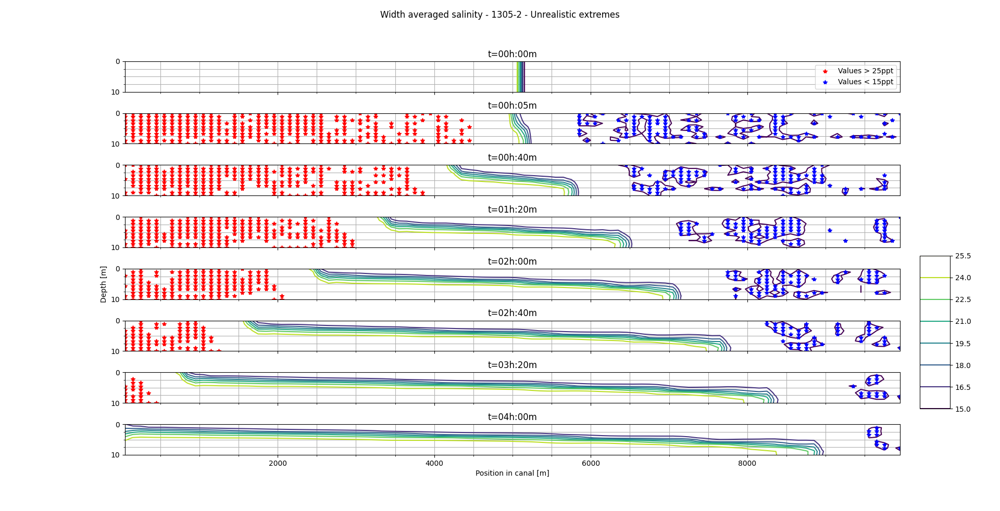

As to the waterlevel the following can be said:

- When the temperature is higher, in the first timestep, oscillations in the waterprofile can be seen in front of the disturbance, besides a large discontinuity around the center of the grid is observed. The fact that these oscillations are not observed at a temperature of 6 degC can be explained due to the relative effect the salinity difference has on the initial density difference, because this effect is smaller at lower temperatures due to a higher density of the water itself the disturbance is of a lower order than at higher temperature. These oscillations are could be a form of numerical dispersion and may be attributed to the hydrostatic assumption of the model, i.e. to compensate for the large vertical velocity gradient in the center of the grid at t=5min the model imposes a waterlevel difference (the large discontinuity). Subsequently to deal with this waterlevel difference in the middle of the grid, the approximation shows oscillations, i.e. in order to bridge the discontinuity in the waterlevel and approximate the original waterlevel at locations where the disturbance has not yet had any influence.
- Other oscillations are observed after the wavefronts (especially the high density wave) has passed. These oscillations could be a result of the artificial viscosity of the model, a process imposed to mimick energy loss due to heat transfer, this results in a transfer of kinetic energy in the form of waves. However, they could also be a result of the internal waves formed due to friction at the interface of the two density currents. Because in this mixing layer turbulence is likely to occur the model could show oscillations in the waterlevel to compensate for the vertical velocity gradients associated with turbulence.

Because the temperature difference has an indirect effect on the forcing it is desirable to keep this at a constant level and try out a range of different salinity deltas. With this reasoning a default temperature of 4 degrees Celsius should be sustained. A final check in 1305-4 where a background temperature of 0 degrees Celsius, shows similar results as obtained from 1305-2 where a temperature of 10 degrees Celsius was set. Given that the density of water at 0 degrees (9998.7 kg/m³) and 10 degrees (9997.5 kg/m³) are similar, this substantiates this similarity. Finally the results obtained in a situation with 4 degree Celsius is presented. 

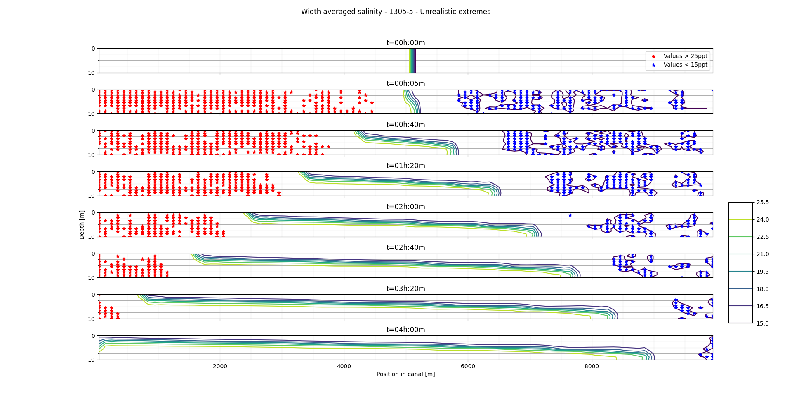

#### Variations in number of layers in z-direction
As to the salinity some observations can be made:

- The frontal wave speed of the lower density current seems to increase increasing layers. The frontal wave speed of the high density current remains almost the same. A frontal wave speed for the low density front of 0.38 m/s, 0.39 m/s and 0.42 respectively for simulations with 20, 50 and 99 depth layers. It seems as if it will approximate the estimated value of 0.49 m/s. 

- Also fewer oscillations at the location where internal waves are expected are possibly observed. 

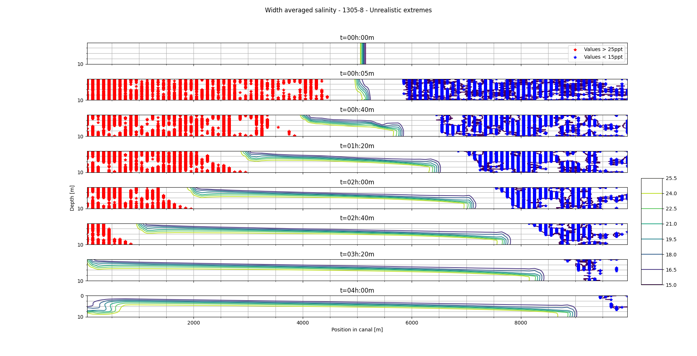

As to the waterlevel some observations can be made:

- The waterlevel seems across all levels seems similar except for the oscillations at locations where the front has already passed, and ofcourse the difference in wavespeed can be observed. In fact compared to the 10 layered model short oscillations seem to dissapear with 20, 50 and 99 layers. However these shorter oscillations seem to be replaced by a single larger oscillation near the end of the simulation (between t=2h and t=4h), increasingly large as the number of layers increase. This could be attributed to the gradual compensation of the waterlevel difference between the locations where the two wave fronts are situated, but it could also be a measure of the internal waves formed at the interface of the two density currents to compensate for the vertical velocity. This requires further investigation.  
- Small oscillations around a constant waterlevel difference across the first 3km of the grid, in each direction, at t=5min are similar across all simulations and indicate numerical dispersion to compensate for the discontinuity of the initial disturbance. 
- The waterlevel dfferences at the locations of each wave front are again expected to be caused by the vertical velocity gradients near the wavefronts for which the model compensates with a waterlevel rise, to fulfill the hydrostatic condition. 
- At a larger number of layers the absolute waterlevel difference across the first 3km of the grid, in each direction, seems to persist longer in the first 40min of the simulation. 

#### General observations
##### Physical observations
The following physical process characteristic for the lock-exchange experiment are observed during both the temperature variations and the variations in number of z-layers.

- The frontal wavespeeds at both fronts are almost linear over time. This indicates an energy conserving approximation may be valid.
- The frontal wavespeed in the high density wave is lower than in the low density wave. This is probably because of the bed friction.
- For the temperature variations the results indicate a temperature of 4 degrees gives the highest water density thus the highest frontal wavespeed. However simulating at a higher temperature could be more relevant, moreover the effect of the salinity difference is more noticable, this is taken into account in the determination of the reference model.
- For the variation of the number of layers in the vertical direction the frontal wavespeed increases a lot as the number of layers increase. It approaches a theoretical estimation as proposed by @Pietrzak1998.

##### Numerical observations
With respect to numerical phenomena the following is observed:

- Numerical dispersion is observed during all simulations at t=5min to deal with the initial disturbance in the waterlevel. This initial disturbance is originates from the model's hydrostatic condition and the large vertical velocity gradients at the start of the simulation.
- Numerical diffusion is possibly observed near the interface of the two density currents. In this mixing layer where turbulunce due to increased shear stresses is expected and clear oscillations are observed when the number of layers is 10. At a higher vertical resolution these short oscillations become a large oscillation with a single wavelenght stretching the grid. This transformation could be a result of the ratio between the horizontal and vertical resolution (1/1000 and 1/100 for 99 and 10 layers respectively) causing different modes in the approximation to be emphasized while trying to account for turbulence in the mising layer.
- The higher resolution, in simulations with more layers, cause more oscillations in the salinity contour lines to be visible near the front. These small oscillations are expected to be numerically diffused turbulence that may be expected at the progressing wavefronts.

#### Conclusions
The computation times were all within reasonable limits while the number of layers in the z-direction reached it's limit at 99. This is a positive result considering future variations in the spatial resolution. With respect to temperature also positive results are obtained that coincide with the expected physics, for this parameter a constant value of 4 degrees celsius can be reasonably determined. However to obtain better insight in what causes the observed phenomena and how these relate to the numerical accuracy of the model more information is required. To this end other plots that are within reach and could be interesting are listed below:

- A table with the extreme values and there order of error
- Courant liming cells in the vertical
- Velocity magnitudes and vertical velocity 
- 3D profiles instead of width averaged plots to get an idea of the numerical effects in the horizontal 
- Detailed plots for the middle of the grid and at locations both fronts to get a detailed view on how the model deals with internal waves and large disturbances respectively.

### Observations
The above results have to be largely summarized and observations of the plots below will be documented. This will give a full description of the reference model.

### Final settings
The settings and conclusions related to the reference model are described.

## Simulations
Here the results per parameter variation will be presented. 

### Interval analysis
Here an interval analysis will be presented for parameters of the model that will be varied during the simulations. Based upon this a valid reasoning for the chosen parameter range is provided.

### Temporal varations
#### Courant number

### Spatial variations
### Initial salinity
### Numerical variations

### Numerical evaluation criteria
Several numerical evaluation criteria, as explained in appendix \ref{appendix-numerics} and according to their relevance to a parameter, will be compared to the results.

## Spectral analysis **optional**
If significan numerical dispersion is observed present a spectral analysis as proposed by @Ruano2019. 

## Sensitivity analyis
The sensitivity analysis based 

# Discussion and conclusion
Final discussion of the results, their applicability and final conclusions are presented here.

# Appendix

# Molecular diffusion
As emphasized by [@Battjes2017, p194]: "..molecular diffusion is irrelevant in civil engineering practice, where turbulent diffusion and dispersion are dominant..". 

In this case however it could be relevant because of the specific experiment. Still with the goal of modelling the Rhine-Maas delta in mind emphasis may be put on diffusion and dispersion processes related to turbulence. Moreover it is assumed constant accross the experiment thus numerical errors can not be specifically dedicated to the diffusion.

# Turbulent diffusion
To describe the turbulent diffusion the fluctuating quantaties are averaged over a certain time and lenght scale. Because of gravity the concentration gradient is positive in the downward z-direction. From the averaging of the turbulent motion and the gravity induced concentration gradient it follows, as quoted from [@Vuik2007, p.197], that: "..turbulent fluctuations cause a mean transport in the direction of decreasing values of the mean concentration, as in a diffusion process."

Because the fluctuating quantities cause such net transport processes, the resulting motion and turbulent properties need to be quantified. To this end @Prandtl1925 defined the concept of mixing lenght that defines the lenght over which the fluctiations cause a deviation from the average state and correspond to the average distance the turbulence eddies travel. For example, velocity fluctuations can be related to the velocity of the turbulent eddies. Further the turbulence induced transport processes are found to be proportional to the concentration gradient, also called the turbulence diffusivity. It has the order of magnitude of the eddie velocity times the mixing lenght.

For vertical diffusion in free surface flows the mixing lenght changes over the depth since it is induced by the bed friction expressed in the bed shear stress (τ-b). Using his an estimate of the particle velocity can be made by the so-called shear velocity which together with a parabolic variation of the mixing length over the depth gives a measure for the turbulence diffusivity: εt = Κ∙u∙L = Κ∙u∙z∙(1 - z/d). Where Κ is the Von Karman coefficient which was previously empirically determined.

In exactly this manner horizontal momentum can be vertically distributed through so-called Reynolds shear stress (τ-xz). Thus, in this case it is not a concentration (c) but a momentum per unit volume (ρu) that is diffused, an effect referred to as eddy viscosity. In a simple free surface flow [@Vuik2007, p.199] shows how this leads to a logarithmic velocity profile.

# Turbulence modelling in D-Flow FM
## Horizontal eddy viscosity
Modelling horizontal eddy viscosity has three seperate parameters that determine the total viscosity as follow: μ-H = μ-sgs + μ-v + μ-H-back.

These three parameters account for the following:
1. Horizontal turbulent viscosity may be underestimated because of the sub-grid scale turbulent motions, i.e. turbulence on a scale smaller than the meshgrid. This can be resolved by the sub-grid scale viscosity: μ-sgs
2. With Reynolds averaged shallow water equations horizontal eddy viscosity might not accounted for (enough) either thus D-Flow introduces the  μ-v. 
3. If extra constant or spatially dependant viscosity is desired the background viscosity μ-back may be added. 

With respect to the 3D viscosity resulting from three-dimensional turbulence a closure model is used [@DFlowTechMan, p.26]. For specific closure models one can even account for unresolved mixing through an ambient background mixing coefficient μ-V-back. Eventually the vertical eddy viscosity is thus calculated by a combination of the 3D viscosity μ-v and μ-mol, the latter being the kinematic viscosity of water, as follows: μ-v = μ-mol + max(μ-v, μ-v-back).

In D-Flow FM four turbulence closure models can be chosen, the first being user defined and the latter three based on models by Kolmogorov and Prandtl, all are explained in further detail in [@DFlowTechMan, p.112-120]; 

1. Constant coefficient - resulting in a parabolic vertical velocity profile
2. Algebraic eddy viscosity closure model - based on the von Karman constant (κ), the bed friction (Cf), without including transport processes, computing mixing lenght (L), the shear velocity and the vertical turbulent viscosity μ-v. 
3. Κ-ε turbulence model - involves solving a non-linear coupled system of equations describing turbulent kinetic energy (Κ) and energy loss (ε) including diffusivity coefficients (D), a turbulent kinetic energy production term (P), a Buoyancy flux (B) and a variation of kalibration terms (c1-3). Therafter the the vertical eddy viscosity μ-v is determined as proportianal to the ratio Κ²/ε and the mixing lenght. Still, this coupled system has to be discretized in terms of advection and diffusion which is done explicitly by a first order upwind scheme and implicitly, respectively. Accordingly the production and buoyancy term are discretized while conserving the diagonally dominant matrix (ensuring positivity). Finally this leads to two tri-diagonal matrices for Κ and ε that can be solved using Thomas algorithm, which may be seen as the tri-diagonal LU-decomposition, by using specific boundary conditions. 
4. Κ-τ turbulence - Where τ is a typical timescale of the turbulent eddies and the eddy viscosity is proportional to Κ∙τ. Coupled by a system of convection diffusion equations including diffusivity, production and buoyance terms. The resulting advection equation is discretized with an first order upwind difference scheme and the vertical diffusion term is discretized implicitly by a temporal discretization scheme. Again this leads to two tri-diagonal matrices that can be solved by the Thomas algorithm using specific boundary conditions.

# Modelling results

## Settings
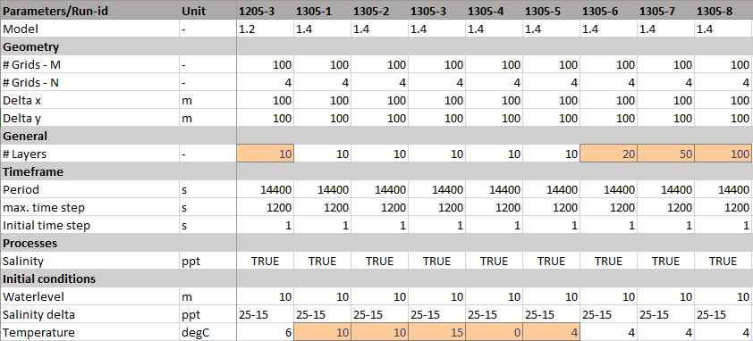

## Temperature variations
### Simulation 1205-3
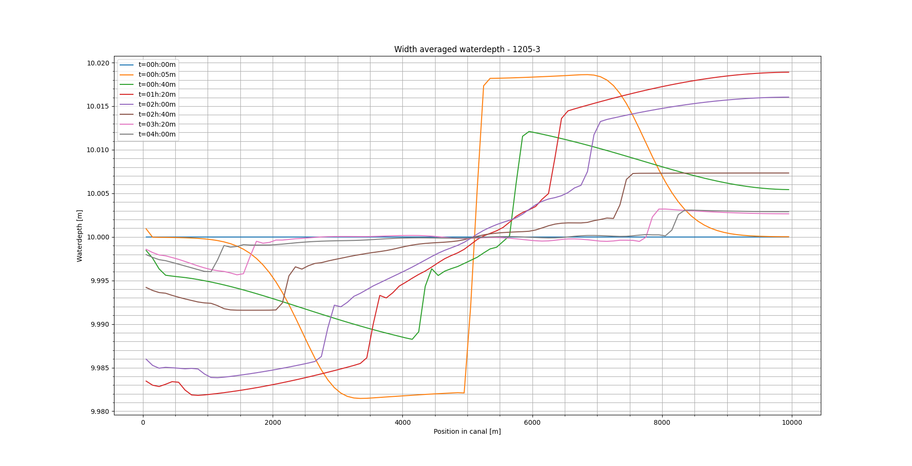

### Simulation 1205-3
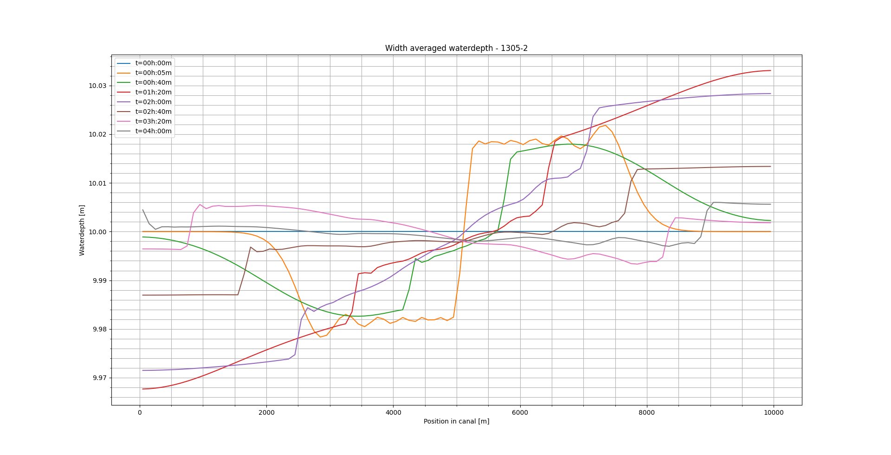

### Simulation 1205-3

### Simulation 1205-3
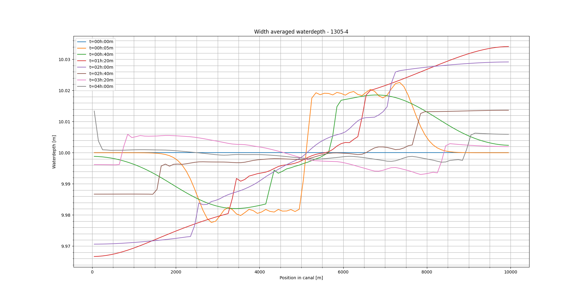

### Simulation 1205-3

## Number of layers in vertical direction variations

### Simulation 1205-3
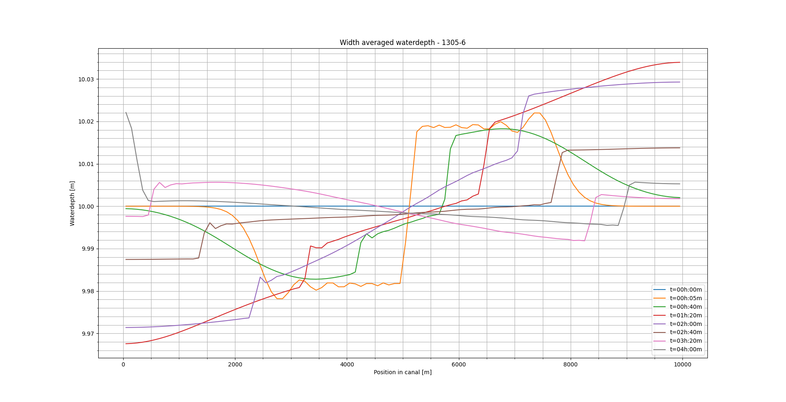

### Simulation 1205-3
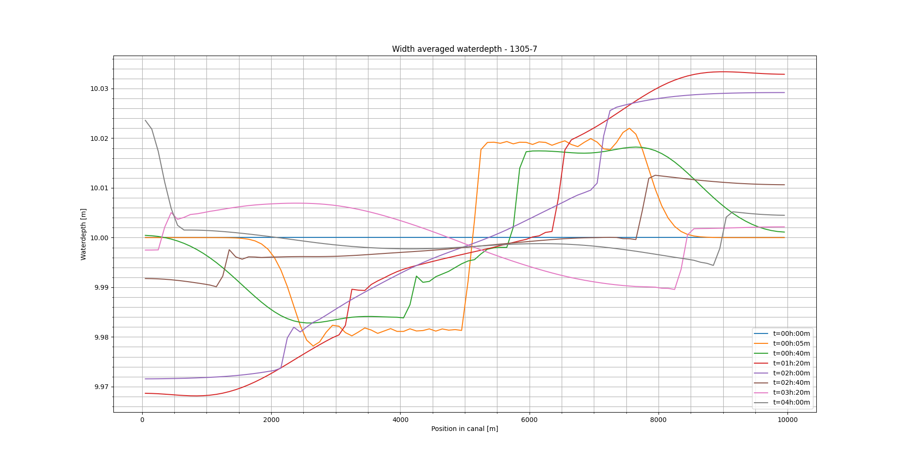

### Simulation 1205-3
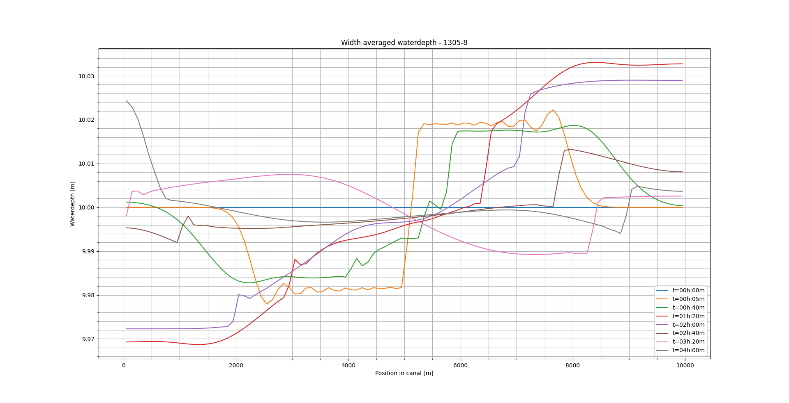

