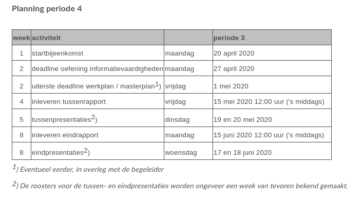
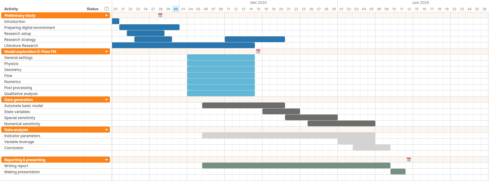

# Notes and comments

## TODO
- Opzet rapport
    - Voorpagina
    - Tekst schrijven
    - Planning integreren
    - Referenties corrigeren
    - Bibliography checken
- Literatuurstudie
    - Technische manual
    - User manual
    - Papers (3)
    - Webpagina's
- D-Flow installeren
    - Tutorials doornemen

## Compilation documents
### TOC
For a TOC run the following commands:
:GenTocGFM
or
vim +GenToGFM
or 

### Simple pdf
sudo apt install texlive-latex-extra
pandoc --from markdown --latex-engine=xelatex -o newpdf.pdf oldmarkdown.md
or
if vim-pandoc is installed:
:Pandoc pdf

### Working example of thesis-markdown-pandoc
pandoc --latex-engine=xelatex -H preamble.tex -V fontsize=12pt -V documentclass:book -V papersize=a4paper -V classoption:openright --chapters --bibliography=test_ref.bib --csl="csl/nature.csl" test.md -o testpdf.pdf

### Workflow tu delft latex
1. Create a .md file per chapter
2. Compile .md file to latex with:"pandoc --bibliography="BEP_reference.bib" --csl="apa-6th-edition.csl" --biblatex sourcefile.md -o output.tex
3. Change the chapter header to match with TU Delft template
4. Include chapter in TU Delft template
5. Move/update the chapterfile to the latex compilation dir
6. Move/update the BEP_reference to the latex compilation dir
7. Run xelatex report
8. Run bibtex report
9. Run xelatex report (2x)

## Planning

## Verplichte onderdelen
### Voorstudie - week 2 
- [ ] Startnotitie maken met plan van aanpak
- [x] Beide begeleiders moeten aanwezig zijn
- [ ] Beoordelen plan van aanpak 
- [x] Student maakt besprekingsverslag

### Modelvorming & analyse - week 4/5
- [ ] Onderzoeksproces doorlopen
- [ ] Beschrijf verdere uitwerking
- [ ] Tussenrapport met tot dusver behaalde resultaten
- [ ] Structuur eindverslag
- [ ] Besprekingsverslag incl. oordeel beide begeleiders

### Uitwerking - week 8
- [ ] Verdere uitwerking
- [ ] Conceptrapportage in week 7
- [ ] Eindproduct
    - 20 kantjes
    - uitgangspunten
    - technische onderbouwing
    - beperkingen
- [ ] Zelfevaluatie

